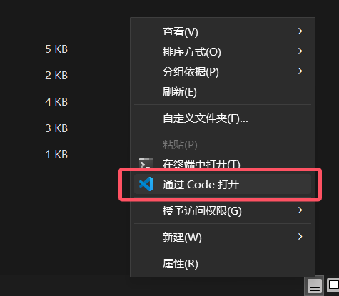
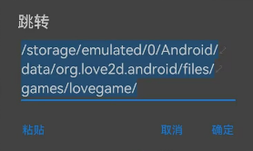

# Getting Started Guide

Welcome to the **LÖVE - SoulEngine** documentation. 
Here you will learn everything about this engine template. 

---

## Preface

I will not tell you to play [UNDERTALE](https://undertale.com/) first, because if you are here for **development**, we can **skip that step**. 
If you want to know what UNDERTALE looks like, watch some videos online; this guide does not cover the game itself. 

If you are seeing this **documentation** before the **engine**, you probably do not know how to download and use it. 
Next, we will start from scratch with installation and downloading so you can run it successfully.  
***Note: No matter which platform you use for development, your environment should support the corresponding version of the LOVE2D framework.***

---

## Installation

You need to install the [LÖVE (LOVE2D)](https://love2d.org) engine. 
This document was written at the end of 2025, and LOVE-12.0 had not been released yet. 
**So we download the latest available version, which is LOVE-11.5.** to prepare for our development.  
*Note: Always pay attention to the latest SoulEngine version number. If the version number is beyond 3.0.0, that means the project has entered the LOVE-12.0 era. In that case, ignore the previous instruction and download LOVE-12.0.* 

After that, download the [SoulEngine](https://github.com/AnskiyyRenew/love2d-undertale-template/releases/) engine.

---

**After completing the two steps above, we will start configuring the coding environment.**

---

### Desktop setup

First, choose a code editor you like. 
For desktop development, I recommend [Visual Studio Code](https://vscode.dev).  
After installation, unzip the SoulEngine archive. 
Then go into the extracted folder and open that location with **VSCode**.  

- Method 1: right-click the extracted folder and choose Open with Code 
- Method 2: open a terminal in the extracted folder and enter `code .` 

 
After opening with **Code**, you should see a lot of items on the left, which means it worked. 
But do not hurry yet, because our setup is not complete and testing the game will still be difficult. 
Next, to make testing more convenient, we need to install an **extension**.  
First, you can see a small square icon on the left:  
Then search for `love2d` in the top search box to filter extensions that include love2d. 
Install the one you prefer, but it is best to choose one that can launch the game quickly. 

From the above, I recommend this extension:  
This is simply a launcher extension and does not interfere with how you write code, which is why I recommend it.  
Next, you need to configure this extension so it works correctly. 

First open Settings using the gear icon in the lower-left corner. Then you will see `Settings`.   
Then type `love` in the top search box so you can quickly locate the LOVE2D settings.  
**Make sure the path is set exactly to the appropriate love.exe program, otherwise the game will not run successfully.**  
After this step, press `Alt + L` to test whether the game opens. If a window appears, then the extension setup is **complete**.  

**Some additional notes** 

Indeed, on `Linux`, there is a better way to launch the game: use the command terminal. 
Open a terminal in the project folder and run `love .` to start the game with LOVE2D.

---

### Mobile setup (Android)

Why not use **iOS**? 
If the free tools there become paid, I cannot help **iOS**.  

You can choose a mobile editor you like, but make sure its import path matches the image shown below:  

*Note: Some phones may not use `/storage/emulated/0/`. Import according to your device, but the final path should be correct starting from `Android/data`.* 

After importing, open the `LÖVE for Android` app to check if it launches successfully. 
If you want to switch games, open the `LÖVE Loader` app and select a `.love` package to launch.

---

## Version number explanation

---

You may have already noticed that `SoulEngine` version numbers follow a specific pattern. Here we explain what each part means. 

We use the most complete format:  `a.b.c-d` 

- `a` stands for the major version. When this number increases, it means the engine has made a **major change**, such as **API modifications** or a large structural rewrite. **Older projects may require significant changes or a complete rewrite to run on this version.**
- `b` stands for the minor version. When this number increases, it means serious bug fixes or important updates were made. In short, it indicates a larger update than the previous version. **Usually old projects only need a few small modifications to continue running.**
- `c` stands for the patch version. When this number increases, it means small bug fixes or optimizations were made. **Generally old projects do not need changes and can run by replacing files.**
- `-` is a separator and has no real meaning.
- `d` is an extra label. If the version is stable, `d` is `stable`; if the version is not yet confirmed stable, `d` can be `alpha`, `beta`, `nightly`, or `lazy`.

 
**Note: Version numbers may also include time-based values down to the hour. If so, compare the version strings carefully.** 

For example: `2025.5.1-15-beta`