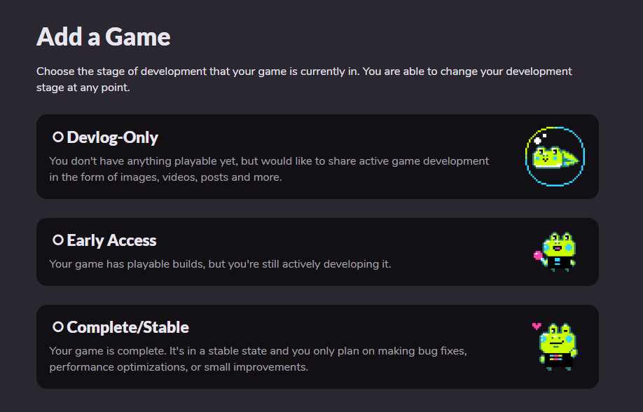
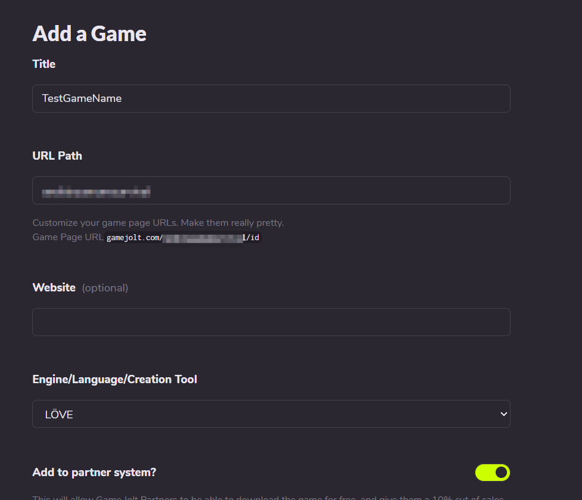
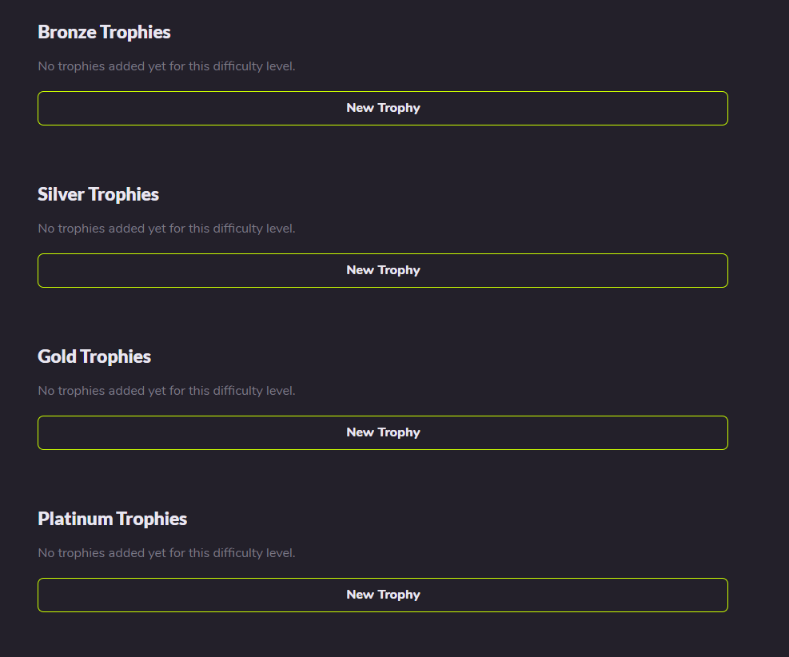
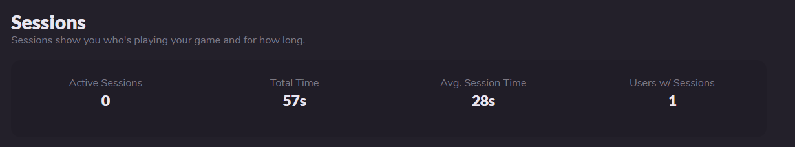

# GameJolt API

---

## Connecting Your Game to the GameJolt Website

### Create your game on the GameJolt website

1. First go to the [GameJolt game publishing page](https://gamejolt.com/dashboard/games/add). Choose one of these three options based on your current development stage.<br>
<br>
    - `Devlog-Only`: You don't have playable content yet, but you want to share your development progress (such as images, videos, posts, or other materials).
    - `Early Access`: Your game has playable content but isn't complete yet; you will continue updating it.
    - `Complete/Stable`: Your game is finished, and you only plan to fix bugs, optimize, or make small updates.

If you just want to test, I recommend choosing the first option. It gives you a perfect personal space.<br>
2. This shows the options after selecting Devlog-Only.<br><br>

- `Title`: Your game name, which appears on GameJolt and forms the first impression.
- `URL Path`: Your game path. Choose an appropriate English path; combined with the random ID, this becomes your game page URL.
- `Website(optional)`: If your game has an official website (for example, an AU page or a dedicated game site), enter it here.
- `Engine/Language/Creation Tool`: The engine/framework used to create the game. **Note: SoulEngine is not listed here, so do not keep looking for it. Choose LOVE instead, because LOVE is the birthplace of SoulEngine.** Of course, if you want to write SoulEngine by hand, that's fine too.
- `Add to partner system?`: If enabled, you can earn revenue through GameJolt's share system. The more fans you have, the more energy orbs you charge, and the more stickers you can get. However, you must first apply to become a GameJolt creator.

Then click `Save & Next` to proceed to the next page.<br>
3. Fill in the Description, Design, and Maturity fields yourself. **After that, click Save Draft to reach this page:**<br>
<br>
4. Click `Game API` in the top menu to open this page:<br>
<br>

**This is the area that the GameJoltAPI library handles.**

### Connect the game to GameJolt in code

Add the following code in `main.lua` at the start of your game to connect to GameJolt.

```lua
local gamejolt = require("GamejoltAPI")

-- Initialize the API (requires GameJolt-provided app_id and private_key)
local success = gamejolt.init(123456, "your_private_key_here")
if not success then
    print("Initialization failed: missing app_id or private_key")
    return
end
```

After this, if the game hiccups slightly during startup, it means the connection is being established.

---

## User System (User)

### How to find your token

1. Click your avatar in the upper right corner (or wherever it appears).
2. Find the `Game Token` option and click it to view your token.<br>


### User login

After the connection is established, the game needs to link to the player's account. The player must enter their username and `token` to log in using `gamejolt.auth_user(name, token)`:<br>

***Warning: do not ask for passwords inside the game. GameJolt explicitly states that requesting passwords is illegal.***

```lua
local success, error = gamejolt.auth_user("myusername", "myusertoken")
if success then
    print("User authentication successful")
    -- After authentication, you can perform other operations that require login
else
    print("Authentication failed: " .. error)
end
```

### Fetch user information

If you're making an online game and want to see how many friends a player has, you can query that player's information using `gamejolt.fetch_user(id, name)`: 

```lua
-- Player enters a friend's username to search
local friend_name = "friend_name_to_search"
local friend_data, error = gamejolt.fetch_user(nil, friend_name)
if friend_data then
    -- Show friend information and provide an option to add them
    -- This function doesn't exist by default; define a suitable one yourself
    show_friend_profile(friend_data)
else
    -- This function also doesn't exist by default; define your own
    show_message("User not found")
end
```

You can also fetch information after login:

```lua
-- After successful authentication, get full user information
local auth_success = gamejolt.auth_user("username", "token")
if auth_success then
    local user_info, error = gamejolt.fetch_user(nil, "username")
    if user_info then
        -- Check account status (for example, whether the email is verified)
        if user_info.status == "Active" then
            proceed_to_main_game()
        else
            show_verification_required_message()
        end
    end
end
```

---

## Trophies

### Add trophies to your game

On the `Game API` page, click `Trophies` to enter the trophy interface.<br>
<br>
There are four trophy tiers:

- `Bronze`: the lowest-tier trophy, usually the easiest to obtain (for example, login or rename).
- `Silver`: the third-tier trophy, usually achievable with some effort (for example, beating Sans).
- `Gold`: the second-tier trophy, usually requires greater skill (for example, a no-medicine Sans fight).
- `Platinum`: the highest-tier trophy, typically very difficult (for example, no-damage Sans fight or finding all secrets and completing everything).

**Note: regardless of difficulty, the designer decides the trophy conditions and the code decides how they are awarded.**<br>

When adding a trophy, provide a square image, then enter a name and a short description.

### Fetch player achievements

When a player logs in, you can fetch all the achievements they have unlocked and display them in the game.

```lua
-- Fetch all achievements
local achievements, error = gamejolt.fetch_achievements(false)
if achievements then
    for i, trophy in ipairs(achievements.trophies) do
        print("Achievement: " .. trophy.title .. " - Status: " .. (trophy.achieved and "Unlocked" or "Locked"))
    end
end

-- Fetch only unlocked achievements
local unlocked_achievements, error = gamejolt.fetch_achievements(true)
```

### Unlock an achievement

For this, you need the trophy ID from GameJolt, which is usually six digits.

```lua
local success, error = gamejolt.unlock_achievement(123456)
if success then
    print("Achievement unlocked successfully!")
else
    print("Achievement unlock failed: " .. error)
end
```

---

## Sessions

If a player opens the game, you can choose to view how many players are online and the total playtime.

### Example display

This is the session overview when a game is first created:<br>
<br>

If Sessions are enabled and a player plays for a while and then quits, it looks like this:<br>
<br>
There are `0` active sessions (no one currently has the game open), the game has been played for `57` seconds total, the average session length is `28` seconds, and one player has played the game.<br>

You can infer that 28 seconds means the same player played two separate sessions.

### Open a session

Use `gamejolt.session_open()` to start a session.

```lua
local result, error = gamejolt.session_open()
if result then
    print("Session opened successfully")
else
    print("Session open failed: " .. error)
end
```

### Keep the session alive with heartbeats

After a session opens, GameJolt may consider it a timed-out session unless you periodically send an activity signal to let GameJolt know the session is still active. This resets the timeout.

Because each session consumes GameJolt server resources, you must keep sending updates to keep the session valid.

Use `gamejolt.session_ping(status)` to maintain session activity.

```lua
-- Default state is active
-- This heartbeat can be sent every two minutes
local result, error = gamejolt.session_ping("active")
if result then
    print("Session heartbeat sent successfully")
end

-- If the player briefly leaves the game (for example by pausing), you can send idle instead without affecting the session
gamejolt.session_ping("idle")
```

### Close a session

When closing the game, add `gamejolt.session_close()` in `love.quit` to tell GameJolt the game has ended and the session no longer needs updates.

```lua
local result, error = gamejolt.session_close()
if result then
    print("Session closed successfully")
else
    print("Session close failed: " .. error)
end
```

---

## Data Storage System (DataStore)

If a player switches to another device (for example a different computer or phone), you can upload their local storage to the GameJolt cloud so they can continue using their previous saved data.

### Store data

Use `gamejolt.data_store(key, data, user_data)` to save data.

```lua
-- Save global game data
local success, error = gamejolt.data_store("level_progress", "level_5_completed", false)
if success then
    print("Data stored successfully")
end

-- Save user-specific data
local success, error = gamejolt.data_store("player_settings", "{"sound":true,"music":false}", true)
```

Of course, `SoulEngine` does not need to manually build JSON strings like this; use the `dkjson` library instead.<br>
[Jump to this page to see how to use the dkjson library](2.md)

### Fetch data

Use `gamejolt.data_fetch(key, user_data)` to retrieve data.

```lua
-- Fetch global data
local data, error = gamejolt.data_fetch("level_progress", false)
if data then
    print("Fetched data: " .. data)
end

-- Fetch user-specific data
local user_data, error = gamejolt.data_fetch("player_settings", true)
```

Or use `gamejolt.data_fetch_all(user_data)` to retrieve all data.

```lua
-- Fetch all global data keys
local all_data, error = gamejolt.data_fetch_all(false)
if all_data then
    for i, key_info in ipairs(all_data.keys) do
        print("Data key: " .. key_info.key)
    end
end
```

Use `gamejolt.data_get_keys(user_data)` to get all keys stored in the data.

```lua
local keys, error = gamejolt.data_get_keys(true)
if keys then
    for i, key in ipairs(keys) do
        print("Key: " .. key)
    end
end
```

### Delete data

When a player chooses to RESET or otherwise clear data, use `gamejolt.data_delete(key, user_data)` to delete an entry.

```lua
local success, error = gamejolt.data_delete("temp_data", true)
if success then
    print("Data deleted successfully")
end
```

---

## Scores / Leaderboard System (Scores)

If you're developing a rhythm game or an UNDERTALE-style game and want a leaderboard, use the score system to record and upload player scores to GameJolt.

### Fetch local scores (no user login required)

Use `gamejolt.fetch_scores_local(table_id)` to get local scores.

```lua
local scores, error = gamejolt.fetch_scores_local(123)  -- 123 is the score table ID
if scores then
    for i, score in ipairs(scores.scores) do
        print("Score: " .. score.score .. " - User: " .. score.user)
    end
end
```

### Fetch global leaderboard scores (user login required)

Use `gamejolt.fetch_scores_global(table_id)` to get the global leaderboard.

```lua
local scores, error = gamejolt.fetch_scores_global(123)
if scores then
    for i, score in ipairs(scores.scores) do
        print("Score: " .. score.score .. " - Sort value: " .. score.sort)
    end
end
```

### Submit a score to the leaderboard

Use `gamejolt.submit_score(score, table_id, sort, extra_data)` to submit a score.

```lua
local success, error = gamejolt.submit_score(1500, 123, 1500, "Clear time: 2:30")
if success then
    print("Score submitted successfully")
else
    print("Score submission failed: " .. error)
end
```

`extra_data` refers to additional submission details, as shown above with `Clear time: 2:30`. It can also be something like: `"Time:2:30|Difficulty:Hard|Stage:5"`.
