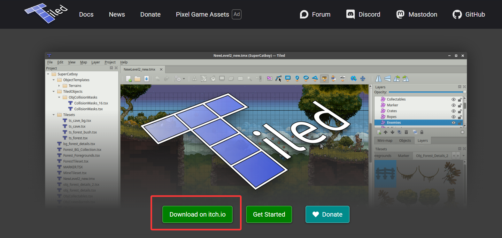

# Getting Started

If you are not sure what the wrench icon means, go to the [homepage](../index.md) and review the description of the icon first.

---

## Install the Mapping Tool

The tool used in this guide is [Tiled](https://www.mapeditor.org/).<br>
It is a convenient and stable map editor, which is why I recommend it.

### Download

On the website, click the circled `Download on itch.io` button to go to the itch.io page and download Tiled.<br>
<br>

If the page does not load or is difficult to access, you can use this alternative link:

```
https://wwatg.lanzouq.com/ipNqa3iggbmh
password: tiled
```
[Open link](https://wwatg.lanzouq.com/ipNqa3iggbmh)<br>

**After extracting the archive, double-click the .msi file to install.**

### Launch Tiled

After downloading, open Tiled. You will see a large blank page with only a few buttons. You are ready for the next topic.
---
