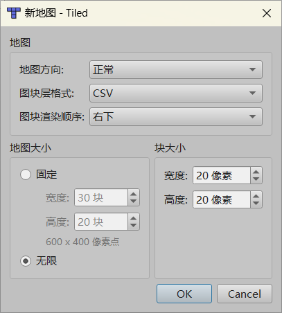
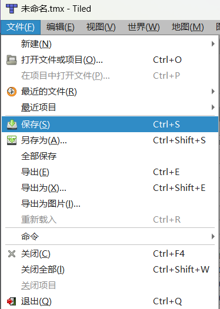
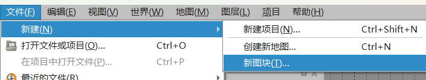
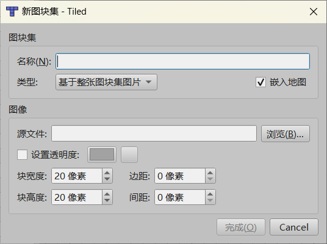
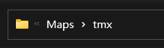
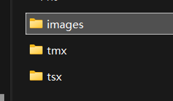
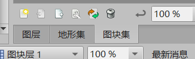
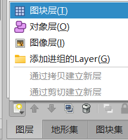
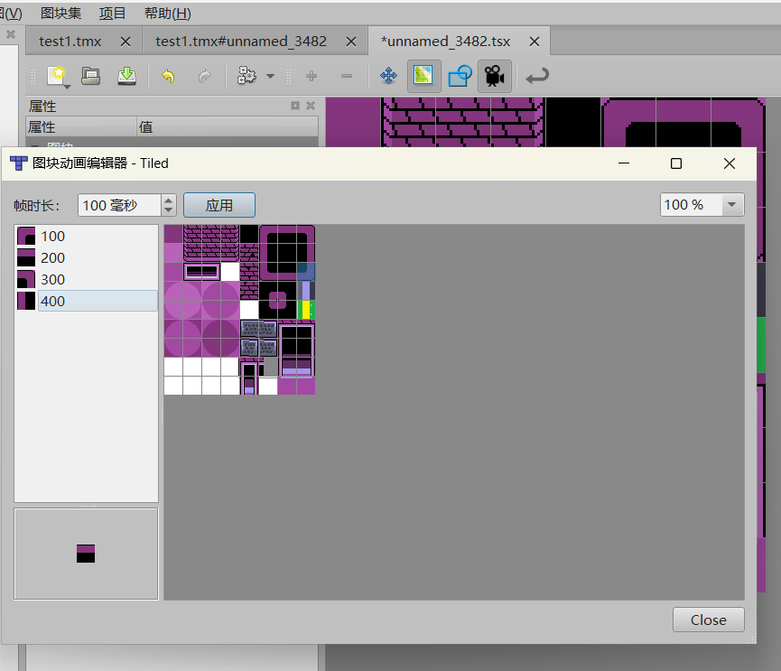

# Create and Draw a Map

Required tool: Tiled.

---

## Create a New Map

### Initialize the Map

After opening Tiled, you will likely only see a few buttons. Find and click the `Create New Map` button. 
 

### Set Basic Tile Properties

After clicking `Create New Map`, a window appears asking you to set tile properties. Set them exactly as shown in the image below. 
 
Then click `OK` to continue.

### Save the Map First

Once the map is created, go to the top-left `File` menu and click `Save`. 
 

**Make sure the save path begins from your project root at `Maps/tmx/`!** 
*I will explain why this matters later.* 

If you see other `.tmx` files in the folder, the save location is correct. Rename the file and save it. 

### Summary

At this point, the Tiled map project is created.

---

## Draw the Map

Before continuing, if you do not know what a `tile` is, read the first section to understand it, then continue map creation. 

---

### What is a Tile?

> Imagine you have a huge world map (for example, 10 meters wide and tall) and want to hang it on the wall. The map is too large to carry.

The solution is to cut the map into many small 1-meter squares. Each small piece is a tile. You can place one tile at a time, and when all tiles are assembled, the full world map is restored. 

**Tile maps have three characteristics:** 

- Tiling: the map is divided into many identical square pieces (often 256x256 or 512x512 pixels).
- Layers: the map has different levels, such as a world layer, continent layer, and street layer. Higher levels contain more tiles and more detail.
- Indexing: each tile has a unique identifier, usually based on x, y, and z coordinates, so the computer can find and load it quickly.

***Now that you know what tiles are and how they work, let's continue.***

---

### Import a Tileset

Click `File` -> `New` -> `New Tileset` to create a tileset. 

 

Then set the tile size to 20x20 pixels to match our map. Also check `Embed in map`. If you do not embed the tileset, the map may fail to load in the game. 

 

Next, click `Browse...` in the Image box. 
***Note: the settings below are critical.*** 

When the browser opens, if it starts in `Maps/tmx`, then the location is correct. Now select a tileset. 
 

Then go back one directory and open the `images` folder. Select the ruins tileset (or any other image you want to use, as long as you paste tiles from it). Click `Open` to import the tileset. 
 

---

### Select a Tile and Paint

In the lower-right corner, click the `Tileset` panel. This is where you choose which tile to paint with. 
 

Click a tile to select it, then drag on the map editor to paint with it. 

---

### Add a New Layer

Suppose you have a vine tile and a wall tile. If you draw them on the same layer, they cannot coexist: either the wall appears and the vine disappears, or the vine appears and the wall disappears. 

In this case, add a new layer and draw them separately in the same cells. 

First click `Layers` in the lower-right corner to switch to edit layer mode. Then click the first icon — a sheet of paper with a yellow star — to add a `Tile Layer`. This solves the drawing conflict described above. 

---

## Draw Animated Tiles

Have you ever wondered how the water under the ruins bridge is animated? 
No extra code is needed; Tiled can do it.

This works because Tiled has a built-in animation editor. 

Open the `.tsx` file for the tileset in Tiled, then select a tile and click the camera icon to open the tile animation editor. 

> Note: no matter what millisecond value you choose, the STI library uses a second-based timer. Just make sure the animation feels correct.

---

## Save the Map

Press `Ctrl + S` or use `File -> Save` in the top-left corner to prevent data loss. 

---

## Do Not Export the Map Yet

***Although the map is drawn, it is not ready to be used in the game yet. After we explain object layers, then you can export the map for the game. Please read on patiently. Exporting too early will lead to problems.***
