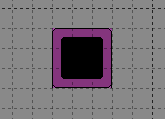
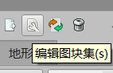
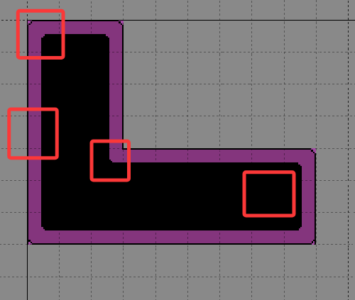
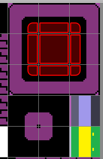
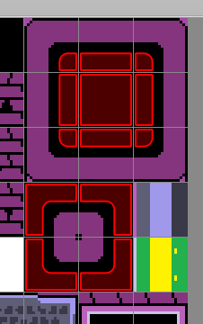

# Use Terrain Tiles to Draw Maps Quickly

---

Suppose you want to create an image like this: 
 

You might need to select many tiles and draw slowly, which easily causes misaligned textures. 
Or you might spend a lot of effort changing tiles at every corner just to fix a small detail. 

Terrain tiles solve this problem. 

## Create a New Terrain Set

To create a new terrain set, click the little wrench icon labeled `Edit Terrain Tiles` in the lower-right corner. 
 

This opens the terrain editor. The right side is where you create new terrain sets. 

### Choose a Set Type

After entering the terrain editor, click the plus icon in the lower-right corner to create a new terrain set. 
There are three types, and their names and uses are as follows: 

- `Corner Set`: suitable for roads, ceilings, and other multi-directional transitions. (A full set contains 16 complete tiles.)
- `Edge Set`: suitable for pipes or other tiles that extend in only four directions. (A full set contains 47 complete tiles.)
- `Mixed Set`: contains both of the above. (A full set contains 256 tiles.)

If you want to tile terrain, use a `Corner Set`. 
If you want to tile artificial pipes or narrow paths that extend in four directions, use an `Edge Set`. 

Here, we choose the large black-bordered option in the upper-right corner to create a Corner Set. This set is best for beginners learning about Corner Sets.

### Create and Name the Terrain

After selecting Corner Set, the upper-right area shows `Unnamed Set`. Give it a name. Since the name is only displayed in the editor, call it `roof`. Also change the numeric ID below; I set it to `1`. 

## Paint Terrain Areas

After creating the terrain set, hover the mouse over the tiles. You will see a small red dot in the corner. That indicates the terrain area. 

> In Tiled, the terrain set editor defines the rules for "Auto-Tiles". The core idea is: **by selecting a tile's position in the terrain set, you define how it should connect to other terrain on the actual map.**

Now let's practice. First, look at the components of a complete tile set.

### Corner Set Terrain Types

 

The four red-boxed areas in the image represent:

- `Corner tiles`: the outermost corner pieces, used for convex corners.
- `Edge tiles`: the outer transition tiles.
- `Inner tiles`: the tiles that fill the interior area.
- `Inner corner tiles`: the tiles used for concave corners.

Now we can assign roles to each tile region.

### Assign Each Tile Type

First, inner tiles are the easiest to recognize, so select them and fill the grid. 

 

Next, paint the eight tiles around the inner tile on the side closest to the inner tile. 

This means those eight tiles will connect directly to the central tile.

Then the four inner corner tiles remain. These tiles cannot touch the central tile at the corner; only two edges can connect.

So when setting those tiles, avoid the corner that cannot touch the inner tile and fill the other areas.

 

**At this point, the corner set is complete and can be used.**

---

## Use the Terrain Brush to Draw Maps

Return to the map. Click the terrain brush at the top, then click `roof` in the right-hand menu and select the terrain ID `1`. When you move the mouse over the map, you will see a group of tiles instead of a single tile. You can drag freely, and the shape updates automatically.

 

**Now you can draw terrain freely without having to manually adjust every tile.**
