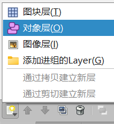
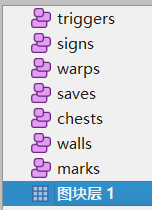
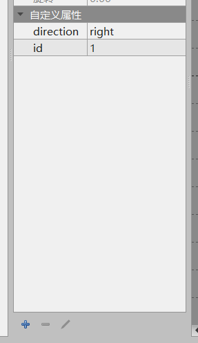
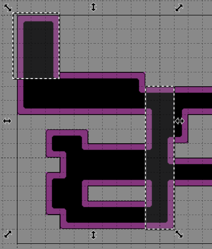

# Adding Objects to the Map

---

If you followed the first topic, then by the end of this topic the map you made in Tiled can be used in the game.

## Object Concept

You may wonder how a map made in Tiled becomes playable. You may ask: 

- How is the player placed on the map?
- How can the player interact with objects? (Even walls can block the player.)

Objects are just an interface. The real implementation happens later. For now, we only need to understand how to create objects.

---

## Build the Object Layers

### Create an Object Layer

Objects are not placed on the same tile layers introduced earlier. They are placed on an object layer. 
First, open the layer view by clicking `Layers` in the lower right corner, then create an `Object Layer` to place objects.

 

### Object Layer Naming Rules

In SoulEngine, object layers are not named arbitrarily. There are rules. Because the engine needs to manage all Overworld objects precisely, the names must be correct. The naming rules and meanings are:

- `marks`: landmark points. The player appears at these points the first time they enter the room. A room may have more than one landmark point. For example, if you enter a corridor with exits to different rooms, the scene may have multiple initial player positions.
- `warps`: teleport areas. When the player steps on them, they move to another room's landmark point.
- `walls`: wall collision areas. When the player hits them, they are blocked outside the wall.
- `saves`: save point locations. When the player steps on them and presses confirm, they can interact and save.
- `signs`: sign locations. When the player steps on them and presses confirm, a dialogue appears. For NPC dialogue, I do not recommend using this; use `triggers` instead.
- `chests`: chest locations. When the player steps on them and presses confirm, they open and allow item storage/retrieval. You can also use them like the triangle rune chest, where items can be taken once and then the chest becomes empty.
- `triggers`: triggers. This is the most powerful feature. It is equivalent to drawing a region for everything you want to control on the map. Use it for switches, pressure plates, story triggers, hidden areas, and even NPC interactions.

When configured correctly, it should look like this: 
 

***Once that is done, you can start adding objects to the object layer.***

---

## Add Objects to a Specific Layer

First, click one of the object layers. You will see some toolbar options become enabled. 

 

In normal development, we usually use the first tool (select an object), the third tool (draw a rectangle object), and the fourth tool (draw a point object).

### Shape Type for Each Layer

You might think a save point should use a rectangle, since it has a small area that blocks the player. But actually, save points use points.

To avoid confusion, here are the required object shapes by layer type: 

- `marks`: use `Point`.
- `warps`: use `Rectangle`.
- `walls`: use `Rectangle`.
- `saves`: use `Point`.
- `signs`: use `Point`.
- `chests`: use `Point`.
- `triggers`: use `Rectangle` or `Point`.

### Add a Property to an Object

> Think about it: a landmark point not only records the player's initial position, it also needs to record the player's facing direction. 

> But if you just place a landmark point, where do you set the player's direction? 
**The answer is: properties.** 

Select a landmark point (first click the `marks` layer, then select an object). You will see a blank `Custom Properties` area on the left. Here you can add the properties you want for that object. 

Next, add a variable named `direction` with type `string`, then click OK. This creates the `direction` property successfully. 
Then add a variable named `id` with type `int`. 
 

**Here are the object properties and types for each layer:** 

- `marks`
    - `direction`: player facing direction, type `string`, with values `up`, `down`, `left`, or `right`.

- `other`
    - any property is allowed.

You may be surprised by this, but the truth is: 
**Only `marks` requires `direction`. The other layers have no enforced requirements.** 

Note: Keep good habits. When creating a new object, give it an `id` property of type `int` with a unique value. This will be very helpful later.

### Auto-align to Grid

> Imagine you are drawing `walls` to limit player movement, but you find precise alignment difficult.

At that point, you may wish the objects would snap to the grid automatically. 

Tiled supports this. Hold `Ctrl` while clicking or dragging the mouse, and the object will snap precisely to the grid. 
The example below shows the left dashed box drawn without `Ctrl`, and the right dashed box drawn with `Ctrl`. The difference is obvious. 

 
