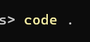
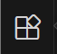
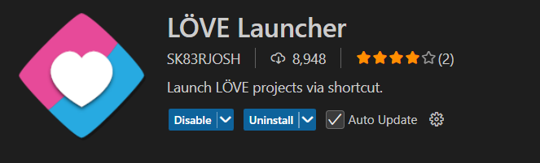
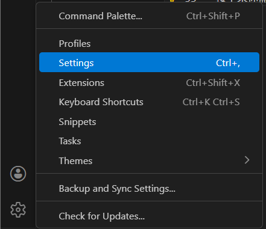
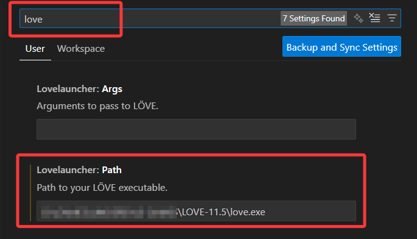

# 入门指南

欢迎来到 **LÖVE - SoulEngine** 的文档。 
在这里，你会认识关于这个引擎模板的所有内容。 

---

## 前言

我不会告诉你优先去游玩[UNDERTALE](https://undertale.com/)，因为如果你是因为 **开发** 而来的人，我们可以 **直接跳过这一步**。 
如果你想知道UNDERTALE游戏是什么样子的，可以去各大视频网站寻找几个视频进行观看，这里不再进行讲述。 

首先如果你接触这个 **文档** 比这个 **引擎** 要早，那么你很可能不知道这个引擎是如何下载并使用的。 
接下来我们从头开始安装下载，并可以让你成功运行。  
***注：无论使用什么平台进行开发，这个开发端都应该支持对应版本的LOVE2D框架。***

---

## 安装

<!---->
你需要安装[LÖVE(LOVE2D)](https://love2d.org)引擎 
这篇文档写于2025年年底，这时候LOVE-12.0版本还并没有发布出来 
**所以，我们下载最新版本，也就是LOVE-11.5。** 来进行我们的开发准备。  
*注：请时刻注意最新版本的SoulEngine引擎版本号是多少，若版本号为3.0.0以后，则证明已进入LOVE-12.0的时期，请无视上面一条并下载LOVE-12.0版本。* 

在这之后，需要下载[SoulEngine](https://github.com/AnskiyyRenew/love2d-undertale-template/releases/)引擎。

---

**以上两步都做完之后，我们开始配置代码环境。**

---

### 电脑端配置

首先，你需要挑选一个你喜欢的代码编辑器。 
对我来说，如果是电脑端我会推荐[Visual Studio Code](https://vscode.dev)  
在安装之后，你需要解压一下SoulEngine的压缩包。 
然后进入 **解压后** 的目录，我们将会让 **VSCode** 定位到这个地方。  

- 方法一：在解压好的目录中右键，选择用Code打开 
- 方法二：用终端打开解压好的目录，输入`code .` 

 
利用 **Code** 打开后，你应该能看见左侧多了一堆东西，这就说明成功了。 
不过现在还别着急，因为我们的适配操作还没有完成，测试游戏会变的比较困难。 
接下来，为了便捷的测试游戏，我们还需要安装一个 **拓展** 。  
首先你可以在左侧看见一个小四方块：  
之后我们在顶部搜索框内搜索`love2d`，这会筛查所有包含love2d字眼的拓展。 
然后我们按需下载，你喜欢哪个就下载哪个，但是最好要包含一个可以快速启动游戏的拓展。 

由上所述，我推荐这个拓展：  
这是一个纯粹的启动拓展而已，并没有过多的干涉你的代码需要怎么写，所以这就是我推荐它的原因。  
接下来你需要配置这个拓展来让其正常工作。 

首先你需要先打开设置，位置位于左下角的齿轮，点开即可看见`Settings`或`设置`：  
然后在顶部的搜索框中输入`love`，这样我们可以以最快速度定位到关于love2d的设置项目：  
**请确保将路径准确的设置为对应的love.exe程序，否则游戏不会成功运行。**  
在这一步之后，我们可以按下 `Alt + L` 来测试游戏是否成功打开，如果弹出了窗口，那么说明拓展部分的配置到此就 **结束** 了。  

**一些其他的小内容** 

诚然，在`Linux`上我们有更好的打开方式，那就是直接通过命令终端进行启动。 
在项目目录中打开命令终端，输入`love .`即可使用love2d启动游戏。

---

### 手机端配置（Android）

至于为什么不用 **iOS** ？ 
如果免费的东西到了那边是收费的，我是没有办法拯救 **iOS** 的。  

你可以选择一个你喜欢的手机代码编辑器，但是要确保它的路径是符合如下图片所展示的：  

*注：有些手机的储存路径可能不是上面所述的`/storage/emulated/0/`，请按情况进行导入，但是最后几个路径是正确的。（从`Android/data`开始）* 

导入之后，打开应用`LÖVE for Android`来查看是否启动成功。 
若想要切换游戏请手动打开`LÖVE Loader`程序来选择一个`.love`后缀的游戏压缩包进行启动。

---

## 版本号说明

---

也许你应该已经发现了，`SoulEngine`引擎的版本有一些特定的规律，接下来这里就是说清楚版本号每一部分代表了什么。 

我们给出一个最全面的解析情况： `a.b.c-d` 

- `a` 意为大版本，这个数字每次加1，就说明这个引擎在这个版本进行了一些 **重大改动** ，例如 **API的修改** ，或者重新改造了很大部分的代码。**老项目想要在此版本运行需要极大的改动甚至推翻重做才能成功运行。**
- `b` 意为较大规模的更新，这个数字每次加1，就说明上个版本某些特别严重的bug被修复，或某些很重要的内容更新了。总而言之，意味着这个引擎和上一个数字有较大更新。**通常只需要在老项目上添加一两行小改动即可继续运行。**
- `c` 意为小规模的更新，这个数字每次加1，说明上个版本的某些小bug被修复，或者一些不起眼但是可以被当做优化的小内容的更新。**通常老项目不需要动，直接复制替换即可正常运行。**
- `-` 连接字符，无实际意义，用于分隔。
- `d` 额外说明。即如果这次更新的版本比较稳定了，那么`d`就显示为`stable`；如果这次更新的版本还不确定是否稳定，需要测试一下，`d`就显示为`alpha`, `beta`等内容，也可能会显示`nightly`或`lazy`等字眼。

 
**注：版本号还有可能显示为带时间的内容，精确到小时，如果有请注意查看版本号的大小。** 

例如：`2025.5.1-15-beta`