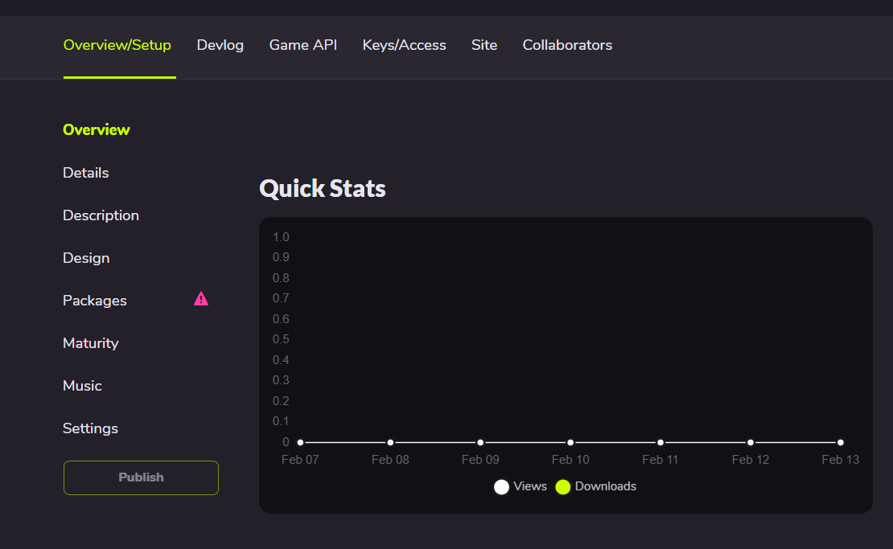
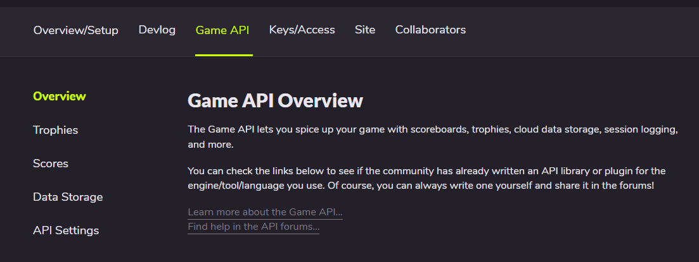
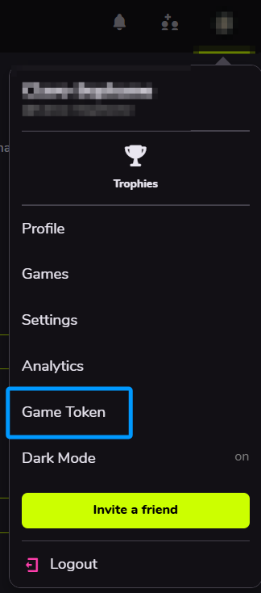
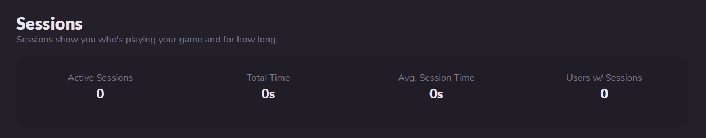

# GameJolt API

---

## 将游戏和Gamejolt网站建立连接

### 在GameJolt网站新建自己的游戏

1. 首先去[Gamejolt游戏发布页面](https://gamejolt.com/dashboard/games/add)，根据自己的需求从这三个选项当中选出一个阶段来代表自己目前游戏制作的进度。<br>
<br>
    - `Devlog-Only`：你现在还没有任何可玩的内容，但是想分享一些游戏开发的历程（如图片、视频、帖子，或其他东西）。
    - `Early Access`：现在这个游戏已经有了可以玩的东西了，但是还不是完全体，你需要以后继续更新。
    - `Complete/Stable`：你的游戏已经是完成状态了，并且你只准备以后修复bug、优化、或者小更新。<br>

如果你只是想要测试，那么我建议你选第一个，这会给你创造一个完美的个人空间。<br>
2. 这里仅展示点击Devlog-Only后的选项<br><br>

- `Title`：你的游戏名称，到时候会放在Gamejolt上，给人留下第一印象。
- `URL Path`：游戏路径，你需要给你自己的游戏起一个合适的英文路径，这个路径加上最后的随机id，就是你的游戏目录。
- `Website(optional)`：这个游戏有没有官方网站，比如你可能为了一个AU而专门创了一个AU页面，或者因为游戏而专门创建了一个网站，均可以写在这里。
- `Engine/Language/Creation Tool`：这个游戏是使用什么引擎/框架制作的。**需注意：里面并没有SoulEngine，请不要一直寻找SoulEngine，而是选择LOVE，LOVE才是SoulEngine的诞生地。**当然如果你想手写SoulEngine也是可以的，我不会说不允许。
- `Add to partner system?`：如果开启了这个，就可以掐钱，这个钱来自于gamejolt的分成，当你的粉丝越多、你能获得的能量球充能就越多，能量球充能越多、贴纸就越多，当然，前提是**你需要先申请成为gamejolt的创作者**才行。<br>

在此后点击 `Save & Next` 以进入下一个页面。<br>
3. 自主填写Description, Design和Maturity内容。**在这之后，点击 Save Draft，可以来到这个页面：**<br>
<br>
4. 点击上方菜单栏的 `Game API`，来到这个页面：<br>
<br>

**这里就是GameJoltAPI库所负责的区域。**

### 在游戏中连接GameJolt网站

在游戏一开始初始化启动的位置 `main.lua` 放入如下代码，即可让游戏连接到GameJolt网站。

```lua
local gamejolt = require("GamejoltAPI")

-- 初始化 API（需要 GameJolt 提供的 app_id 和 private_key）
local success = gamejolt.init(123456, "your_private_key_here")
if not success then
    print("初始化失败：缺少 app_id 或 private_key")
    return
end
```
在这之后，如果初始化游戏出现了微卡顿，那么说明正在建立连接。

---

## 用户系统（User）

### 如何找到自己的token

1. 首先点开右上角的头像（或者可能有人在其他地方）。
2. 找到 `Game Token` 选项，点击之后就是token。<br>


### 用户登录

在建立了连接后，游戏需要和游玩者的账号建立连接，这需要游玩者自己输入名字和 `token` 来进行登录，使用 `gamejolt.auth_user(name, token)` 来认证用户：<br>

***禁区提醒，不要在游戏内把输入Token写成输入密码，在GameJolt中明确写到：索要密码是非法的。***

```lua
local success, error = gamejolt.auth_user("myusername", "myusertoken")
if success then
    print("用户认证成功")
    -- 认证成功后可以执行其他需要认证的操作
else
    print("认证失败：" .. error)
end
```

### 查询用户信息

如果以后制作出来了一款联机游戏，想要获取这个玩家有多少个好友，就可以使用 `gamejolt.fetch_user(id, name)` 来查询这个玩家的信息：

```lua
-- 玩家输入好友用户名进行查找
local friend_name = "要查找的好友名"
local friend_data, error = gamejolt.fetch_user(nil, friend_name)
if friend_data then
    -- 显示好友信息并提供添加选项
    -- 这个函数并不存在，需要自己定义一个合适的
    show_friend_profile(friend_data)
else
    -- 这个函数也不存在，也需要自己定义
    show_message("未找到该用户")
end
```

还可以在登录后直接拉取信息：

```lua
-- 用户认证成功后，获取完整的用户信息
local auth_success = gamejolt.auth_user("username", "token")
if auth_success then
    local user_info, error = gamejolt.fetch_user(nil, "username")
    if user_info then
        -- 检查用户账户状态（如是否验证邮箱等）
        if user_info.status == "Active" then
            proceed_to_main_game()
        else
            show_verification_required_message()
        end
    end
end
```

---

## 成就系统（Trophies）

### 为游戏添加成就

在 `Game API` 页面中，点击 `Trophies` 进入成就界面。<br>
<br>
四种成就分别为：<br>

- `Bronze`：铜奖杯，最低级成就，通常被设置为最好获得的（比如登录，改名等）。
- `Silver`：银奖杯，第三档成就，通常被设置为需要稍作努力可以获得的（比如通过Sans战斗）。
- `Gold`：金奖杯，第二档成就，通常被设置为需要较熟练的技巧才可以获得的成就（比如无药Sans战）。
- `Platinum`：白金奖杯，最高级成就，通常设置为极高难度（比如无伤Sans战或发现全彩蛋、完成其他全成就）。

**注：无论成就的难度如何，都由制作者自己决定，也由制作者自己写的代码决定。**<br>

添加成就时提供一个正方形图片，随后输入名称和简短介绍即可。

### 获取玩家已完成的成就

玩家登录时，可以获取当前玩家所完成的所有成就，在游戏中开启已获取开关。

```lua
-- 获取所有成就
local achievements, error = gamejolt.fetch_achievements(false)
if achievements then
    for i, trophy in ipairs(achievements.trophies) do
        print("成就：" .. trophy.title .. " - 状态：" .. (trophy.achieved and "已解锁" or "未解锁"))
    end
end

-- 只获取已解锁的成就
local unlocked_achievements, error = gamejolt.fetch_achievements(true)
```

### 让玩家获取成就

这里的成就需要去Gamejolt中查看成就ID， `通常是六位数的` 。

```lua
local success, error = gamejolt.unlock_achievement(123456)
if success then
    print("成就解锁成功！")
else
    print("解锁失败：" .. error)
end
```

---

## 会话系统（Sessions）

如果一个玩家打开了游戏，在这里可以选择查看当前在线玩家有几个人，总共游玩时长是多少。

### 效果展示

这是一开始创建游戏的会话内容：<br>
<br>

如果开启了Session，玩家游玩了一段时间，并且退出了，那么整体看下来就是这样的：<br>
<br>
总共有 `0` 个活跃的会话（现在还没有人打开游戏），游戏总共被游玩了 `57` 秒，所有会话平均游玩了 `28` 秒，一共有一名玩家游玩。<br>

可以推出28秒指的是这一位玩家游玩了两次。

### 开启会话

使用 `gamejolt.session_open()` 来开启一个会话。

```lua
local result, error = gamejolt.session_open()
if result then
    print("会话开启成功")
else
    print("会话开启失败：" .. error)
end
```

### 保持会话发送活跃信息

会话被开启后，GameJolt可能会认为是**超时的会话**，所以在超时之前，必须发送一个活跃信号来让GameJolt知道：这是一个正在活跃，没有超时的会话，来以此重新让超时时间归零。<br>

因为每一个会话都在占用GameJolt的服务器资源，所以必须时刻发送数据来保证会话是有效的。<br>

使用 `gamejolt.session_ping(status)` 来保持会话的活跃状态。

```lua
-- 默认状态为 active
-- 心跳数据保证每2分钟发送一次即可，也就是说下面这个代码每两分钟执行一次
local result, error = gamejolt.session_ping("active")
if result then
    print("会话心跳发送成功")
end

-- 如果玩家短暂离开游戏（比如按下了暂停），可以发送 idle，不影响
gamejolt.session_ping("idle")
```

### 退出会话

当关闭游戏的时候，我们需要在 `main.lua` 的 `love.quit` 函数中写入 `gamejolt.session_close()` 函数来告诉GameJolt游戏已经被关闭了，会话不需要再更新了。

```lua
local result, error = gamejolt.session_close()
if result then
    print("会话关闭成功")
else
    print("会话关闭失败：" .. error)
end
```

---

## 数据存储系统（DataStore）

假设有一个玩家换了一个设备进行游玩（可能是换了一台电脑或者转移到手机上游玩了），这时候，为了保证能够继续使用上次设备留下的本地存储global，我们需要将其上传到GameJolt云端中。<br>

这会让玩家就算换了个设备，只要登录之前的账户，一样可以获得到游玩记录。

### 存储数据

使用 `gamejolt.data_store(key, data, user_data)` 来存储一个数据。

```lua
-- 存储游戏数据（全局数据）
local success, error = gamejolt.data_store("level_progress", "level_5_completed", false)
if success then
    print("数据存储成功")
end

-- 存储用户特定数据
local success, error = gamejolt.data_store("player_settings", "{\"sound\":true,\"music\":false}", true)
```

当然， `SoulEngine` 不需要这样手写json格式存储，使用 `dkjson` 库即可。<br>
[跳转到此页查看dkjson库的使用方法](2.md)

### 获取数据

使用 `gamejolt.data_fetch(key, user_data)` 来获取数据。

```lua
-- 获取全局数据
local data, error = gamejolt.data_fetch("level_progress", false)
if data then
    print("获取的数据：" .. data)
end

-- 获取用户特定数据
local user_data, error = gamejolt.data_fetch("player_settings", true)
```

或者使用 `gamejolt.data_fetch_all(user_data)` 来获取全部的数据。

```lua
-- 获取所有全局数据键
local all_data, error = gamejolt.data_fetch_all(false)
if all_data then
    for i, key_info in ipairs(all_data.keys) do
        print("数据键：" .. key_info.key)
    end
end
```

使用 `gamejolt.data_get_keys(user_data)` 函数来获取所有键值对中的键。

```lua
local keys, error = gamejolt.data_get_keys(true)
if keys then
    for i, key in ipairs(keys) do
        print("键名：" .. key)
    end
end
```

### 删除数据

当玩家选择RESET重置的时候，或者其他清空数据账号的选项之后，可以选择使用 `gamejolt.data_delete(key, user_data)` 来删除一个数据。

```lua
local success, error = gamejolt.data_delete("temp_data", true)
if success then
    print("数据删除成功")
end
```

---

## 分数/排行榜系统（Scores）

假设你开发了一个音游，想要制作一个排行榜系统；或者开发了一个UNDERTALE游戏，想要制作一个排行榜，看谁在游戏里得分最多。这时候就需要使用分数系统将玩家的分数记录下来并上传到GameJolt。

### 获取本地分数（不需要用户登录）

使用 `gamejolt.fetch_scores_local(table_id)` 来获取一个本地分数。

```lua
local scores, error = gamejolt.fetch_scores_local(123)  -- 123 为分数表ID
if scores then
    for i, score in ipairs(scores.scores) do
        print("分数：" .. score.score .. " - 用户：" .. score.user)
    end
end
```

### 获取全球分数榜（需要用户登录）

使用 `gamejolt.fetch_scores_global(table_id)` 来获取全球分数榜。

```lua
local scores, error = gamejolt.fetch_scores_global(123)
if scores then
    for i, score in ipairs(scores.scores) do
        print("分数：" .. score.score .. " - 排序值：" .. score.sort)
    end
end
```

### 将分数上传到排行榜

使用 `gamejolt.submit_score(score, table_id, sort, extra_data)`来提交分数到排行榜上。

```lua
local success, error = gamejolt.submit_score(1500, 123, 1500, "通关时间: 2:30")
if success then
    print("分数提交成功")
else
    print("分数提交失败：" .. error)
end
```

`extra_data` 指的是提交附加信息，就如上示例所演示的 `通关时间：2:30`。也可以是：`"时间:2:30|难度:困难|关卡:5"` 等这种复杂信息。