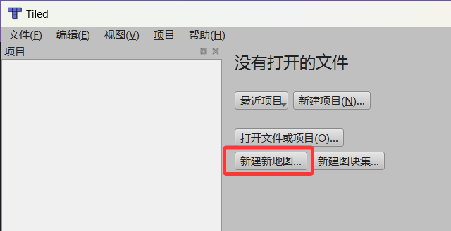
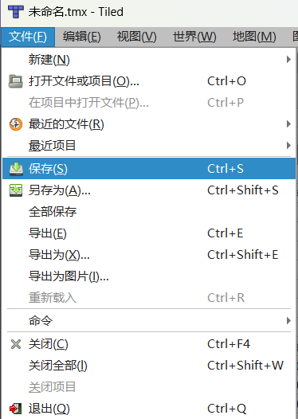
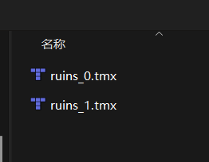
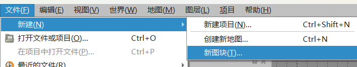
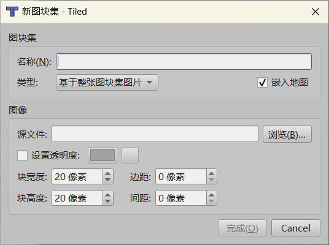
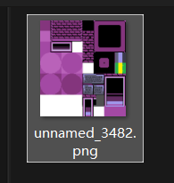
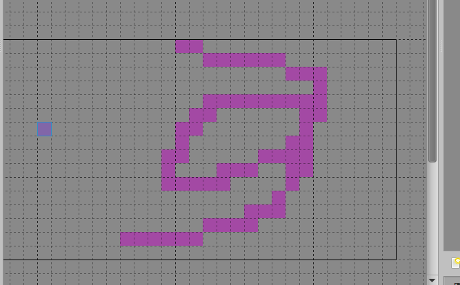
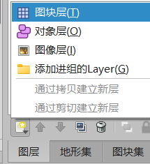

# 🔧创建并绘制地图

需要准备的工具：Tiled。

---

## 新建一张地图

### 初始化地图

进入Tiled后，你可能只会看到几个按钮在上面，找到 `创建新地图` 按钮并点击。 
 

### 设置基本瓦片属性

点击 `创建新地图` 按钮之后，会弹出来一个窗口，让你设置瓦片的属性，接下来请和下面这个图片的内容一样原封不动地设置。 
 
在这之后，我们点击 `OK` ，便可以继续推进进程。

### 优先保存地图

进入后，寻找左上角的 `文件`，随后点击 `保存`。 
 

**需注意：路径一定要保存到从你的项目开始：`Maps/tmx/`文件夹中！** 
*至于为什么要这样保存，我会在后面解释。* 

比如你可能点开tmx文件夹后看见其他的 `.tmx` 文件，如果是，那么证明存储的地方是正确的，改名后点击保存即可。 

### 小结

到此，一个Tiled地图项目便创建好了。

---

## 绘制地图

首先，再开始之前，如果你不知道什么是 `瓦片` ，请阅读完第一个小节，来明白什么是瓦片，之后我们继续进行地图制作。 

---

### 什么是瓦片

> 想象一下，你有一张巨大的世界地图（比如长宽都是10米），你想把它挂在墙上。但整张地图太大了，你根本拿不动。

解决方案：你找来一把刀，把这张大地图切成很多个边长1米的小方块。这样，你每次只需要拿一小块（也就是一个“瓦片”），轻松地贴在墙上。最后，所有小方块拼在一起，就还原了完整的世界地图。 

**瓦片地图有三个特点：** 

- 分块（Tiling）：地图被切成了无数个大小完全相同的正方形（通常是256x256像素或512x512像素）。
- 分层（Layers）：地图有不同的“放大级别”（Zoom Level）。比如，Zoom 0是整个世界，Zoom 1是各大洲，Zoom 18是街道。级别越高，瓦片越多，细节越清晰。
- 索引（Indexing）：每个瓦片都有一个唯一的“身份证号”（通常是x, y, z坐标），方便计算机快速找到并加载它。

***在了解了什么是瓦片、以及瓦片怎么用之后，我们可以继续正式制作了。***

---

### 导入瓦片集合

点击 `文件` -> `新建` -> `新图块` 来创建一个图块集（瓦片集）。 

 

之后，为了贴合我们地图瓦片大小，将瓦片大小全部设置为20*20像素的。随后，勾选上选项 `嵌入地图` ，如果不选择 `嵌入地图` ，那么这个地图会在实装到游戏内的时候加载失败。 

 

接下来，我们点击 `图像` 框内的 `浏览...` 。 
***注：接下来的内容非常关键，请一定要这样设置。*** 

点开浏览后，如果和图片里一样初始位置位于 `Maps/tmx` 中，那么说明是正确的，这时候需要寻找一个瓦片集。 
 

在这之后，我们回退到上一个目录，可以看到 `images` 文件夹出现，双击进入这个文件夹。随后选中遗迹的瓦片（或者其他图片也可以，前提是你需要把瓦片粘贴到这里面）。点击 `打开` ，这样一个瓦片集就导入成功了。 
 

---

### 选中瓦片绘制

来到右下角，我们点击 `图块集` ，这将是我们绘制一个地图长什么样子的关键的地方。 
 

选中其中一个瓦片后（鼠标单击对应的瓦片格子），便可以在地图编辑器中拖拽绘制了。 

---

### 添加新图层

假设你有一个藤蔓贴图（其它地方是空白的），而你还拥有一个墙壁贴图（看起来非常适合让藤蔓爬上去），这时候，如果将他们两个在同一个图层中绘制。你会发现二者不可兼得：要么墙壁绘制上去了，藤蔓没了；要么藤蔓上去了，墙壁不见了。 

这时候，就需要添加一个新的图层，将两张图片分开绘制在一个格子中即可。 

首先点击右下角的 `图层` ，我们切换到编辑图层状态。随后点击第一个图标，一张纸右上角有一个黄色的小五角星，这时候，我们点击添加 `图块层` ，即可解决上文所说的瓦片冲突问题。 

---

## 绘制动态瓦片

你是否曾想过遗迹桥下的动态水面是怎么制作的？ 
无需额外的代码操控，在Tiled中我们可以完成这一操作。 

这得益于Tiled内置的动画编辑器。 

首先使用Tiled打开图块的 `.tsx` 文件，然后选择一个图块点击上面的摄像机图标，打开图块动画编辑器。 

> 注意：不论选择的毫秒数是多少，STI库使用的都是精确的秒计时器，所以只需要保证切换效果符合预期效果即可。

---

## 保存地图

按下 `Ctrl + S`或手动去左上角的 `文件` 点击保存，防止工程丢失。 

---

## 不要立刻导出地图

***虽然现在地图已经绘制好了，但是仍旧没有到达能够放入游戏内的程度，在讲解完对象层之后，我们才可以导出一个地图安装到游戏中。在此之前，请耐心学习。否则直接导出免不了碰壁。***