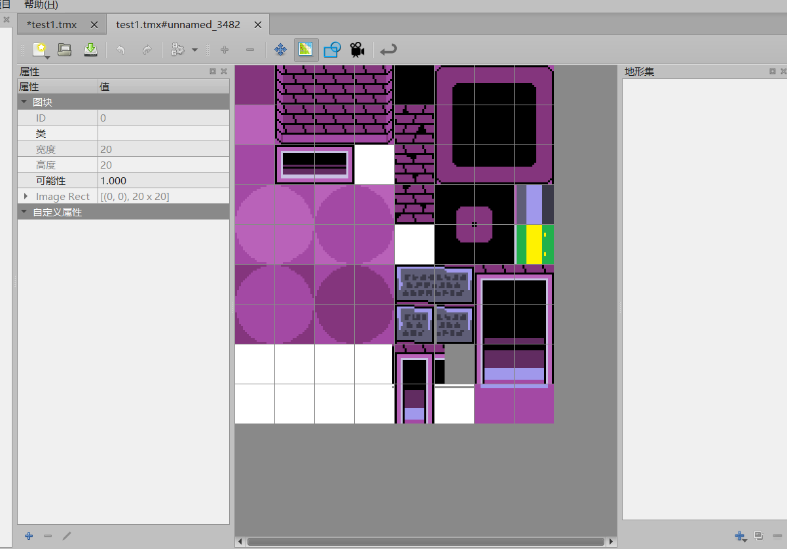
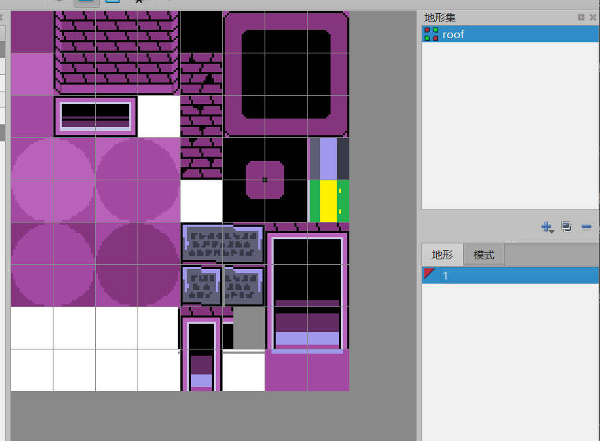
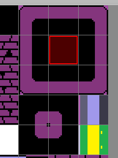
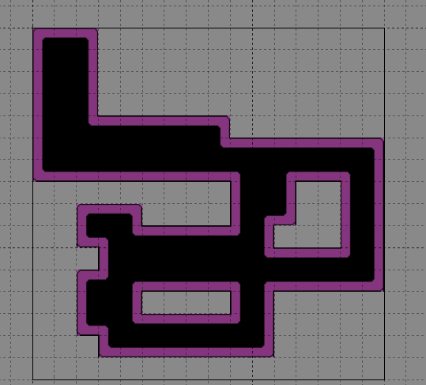

# 🔧利用地形块迅速绘制地图

---

假设你想要绘制一个这样的图片： 
 

你可能需要勾选很多东西然后慢慢绘制，稍有不慎，就会造成贴图错位。 
又或者说每次拐角，都需要投入大量精力去更换贴图，只为了一个小角。 

而地形块，恰好解决了这个问题。 

## 新建地形块

为了新建一个地形集，我们需要点击右下角的小扳手图标 `编辑地图块` 。 
 

之后可以来到这个页面，右侧便是我们新建地形集的位置。 

### 挑选集合

在进入后，点击右下角的加号来新建一个地形集。 
这里一共有三种类型，其名称和运用场景如下： 

- `转角集`：适合用于道路，天花板等一些多方向过渡拼接的瓦片。（完整情况下拥有16个完整贴图）
- `边缘集`：适用于管道等只包含四个延展方向的瓦片。（完整情况下拥有47个完整贴图）
- `混合集`：包含了上面两个的瓦片。（完整情况下拥有256张图片）

如果想要拼接地面，那么使用 `转角集` 。 
如果想要拼接人工管道或者一些只能沿着四个方向扩充的小路，那么使用 `边缘集`。 

在这里，我们选用右上角的大黑框来创建一个转角集，这个集合最适合新手入门了解 `转角集` 。 

### 新建地形并命名

选择转角集，右上角显示为 `未命名集` ，这时候我们给它去一个名即可，由于这个只会在高处显示，我们叫其 `房顶（roof）`  ，同时，需要注意更改下方的名称，我这里改成了 `1` 。 

## 绘制地形区域

添加了之后，将鼠标放到瓦片上，你会发现角落里时不时出现了一个小红点，那就是地形区域了。 

> 综合来说：在Tiled编辑器中，地形集（Terrain Set）的编辑界面是用来定义“自动瓦片（Auto-Tile）”规则的。它的核心逻辑是：**通过选择瓦片在“地形集”中的位置，来定义它在“实际地图”中应该连接哪块地形。**

现在，让我们开始实践。不妨我们先来看看一个完整的图块都由哪些部分组成。 

### 转角集地形类型

 

如上图四个红框圈起来的部分所示： 

- `角块`：它们包裹着最外层的转角部分，主要负责 `凸角` 的情况。
- `棱块`：它们负责最外层部分的过渡状态。
- `内块`：它们负责填充由外层包裹的所有部分。
- `内角块`：它们负责填充内部转角（凹角）的部分

那么，接下来，我们可以通过它们的区域来进行划分了。

### 划分每个瓦片的职能

首先，内块是最好认的，因此我们先选中内块并涂满格子。 

 

随后，我们在内块周围八个瓦片上，靠近内块的一侧绘制一圈。 

这表明周围这八个图片要紧贴中间这个图片进行绘制。 

接下来，是四个内角块，这四个内角块的角都不能紧贴着内块进行绘制，而是只有两条边可以紧贴。 

所以我们在设置图片的时候，需要绕过不能贴内块的角，绘制其他几个区域。 

 

**到目前为止，你已经画完了一个转角集，它已经可以被投入使用了。**

---

## 使用地形刷绘制地图

回到地图中，我们点击顶部的地形刷，然后点击右侧菜单栏中的 `roof` ，并选择刚才创建的 `1` ，这时候再把鼠标放上去会发现，已经不是单个图片了，而是一组图片，可以随意拖拽，它会跟随实时情况进行改变。 

 

**现在你可以随意的绘制任何地形了，而且不需要太麻烦的修改。**