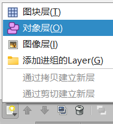
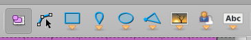

# 🔧在地图中添加对象

---

如果你从第一个专题看到了这一专题，那么，在这一专题结束后，在Tiled中制作的地图就可以实装到游戏内了。

## 对象的概念

你可能会好奇，Tiled中制作的地图，是怎么变的可玩的，也许你会想： 

- 玩家是怎么被放置到地图里的。
- 玩家为什么可以和里面的一些物体交互（甚至墙面可以阻挡玩家）。

对象只是一个 `接口` 罢了，实际的背后操作，还在之后的专题中有所讲解，目前，我们只需要了解**如何创建对象**即可。

---

## 搭建对象层

### 创建对象层图层

对象，不和之前专题中所说的 `图块层` 一样在一个层中，而是位于 `对象层` 中。 
下面我们来创建对象层，首先点击右下角的 `图层` 选项进入图层页面，然后点击 `对象层` 来创建一个可以放入物体的图层。 

 

### 对象层的命名规则

在 `SoulEngine` 中，每一个对象层都不是随意命名的，都是有规则的。 
由于要准确管理Overworld的所有对象以保证它们发挥出应有的功能，不允许随意命名，下面是命名规则以及含义： 

- `marks`：地标点，当玩家初次进入此场景时，玩家会来到的地点，通常一个房间会有不止一个地标点。假设你进入了一个走廊，左右两端可以去往不同的房间。而当从其他房间回到当前场景的时候，则有 `两个` 不同的玩家初始位置（一个在左边一个在右边）。
- `warps`：传送区域，当玩家踏入的时候，会通往其他房间的某个地标点上。
- `walls`：墙壁阻挡区域，玩家碰到之后会被阻挡在墙壁外，需要使用这个物品类型来放置在一个场景所有玩家不可走的区域上。
- `saves`：存档点位置，当玩家碰到之后按下 `确认键` 可以与它交互并确认是否存档。
- `signs`：告示牌位置，当玩家碰到之后按下 `确认键` 可以与它交互并产生对应的对话，如果想要制作一个NPC对话，那么我不建议使用这个，我建议使用 `triggers` 来制作一个NPC对话。
- `chests`：箱子位置，玩家碰到之后按下 `确认键` 可以和箱子交互并打开箱子存放/拿取物品。也可以制作成三角符文那种从箱子中获取物体之后打开为空的操作。
- `triggers`：触发器，这是最强大的一个功能，相当于在地图上绘制你想要的所有你想管辖的区域。遗迹墙壁上的开关、可以被踩的按钮、甚至剧情触发、隐藏位置寻找、包括上文提到的NPC对话，都可以使用 `triggers` 来完成。

如果你创建好了这些层，那么它会如下所示。 
 

***完成了之后，我们可以开始往对象层里面添加对象了。***

---

## 在指定对象层中添加对象

首先让我们点击其中一个对象层，然后你会发现顶部菜单栏有一些选项亮了起来。 

 

在正常开发中，我们只会用到第一个 `（选择一个物体）`、第三个 `（绘制矩形物体）` 、第四个 `（绘制点状物体）` 。

### 每个图层对应的形状

可能你会认为存档点需要用一个矩形？毕竟存档点可是有一个小区域可以阻挡玩家的。但实际上，存档点用的就是点！ 

为了防止在后续制作中混淆每个图层使用的类型，在这里我会将它们一一列出： 

- `marks`：地标点，使用 `点` 。
- `warps`：传送区域，使用 `矩形` 。
- `walls`：墙壁障碍区域，使用 `矩形` 。
- `saves`：存档点，使用 `点` 。
- `signs`：告示牌，使用 `点` 。
- `chests`：箱子，使用 `点` 。
- `triggers`：触发器，使用 `矩形` 或者 `点` 均可。

### 给物体添加一个属性

> 让我们想一下：一个地标点，除了可以记录玩家一开始进入房间的位置以外，还可以记录什么？ 
答案是：方向。 

> 但是我只是在某个地方放置了这个地标点，从哪里设置玩家的面朝方向呢？ 
**答案是：属性。** 

让我们选中一个地标点（这需要你优先点击marks图层随后选中一个物体），我们可以看到左侧有一个空白的 `自定义属性` 区域，那么我们可以在这里输入我们想要给予一个地标点的属性。 

接下来请新增变量，输入 `direction` 确保类型为 `string` 之后，点击ok，即可成功创建 `direction` 变量。 
同理，让我们创建 `id` 变量，确保类型为 `int` 。 
 

**下面给出所有类型物体可以设置的属性，及其类型和可选值：** 

- `marks`
    - `direction`：玩家面朝方向，类型 `string` ，可选值为 `up, down, left, right` 四个值其中之一。

- `其他`
    - `任意`

看到上面这样的结果你可能有点意外，但是事实是： 
**只有marks被强制要求设置direction，剩下的类型均没有做任何强制要求。** 

注意：请保持良好习惯，在每个新物体被创建时，请给予一个 id 名字的变量，类型为 int ，给予一个独一无二的值，这会对以后的制作有巨大帮助。

### 自动对齐网格

> 让我们设想一下你正在绘制walls，来限制玩家的移动区域，但是你突然发现，想要精准的对齐墙面十分困难。

这时，你可能在想：如果能对齐网格就好了，这样就不用手动对齐了。 

Tiled当然支持这个功能，只需要你按住 `Ctrl` 键，然后点击鼠标、或者拖拽鼠标，就会发现所有的物体都被精确的吸附到了网格中。 
下图演示内容中，左上角的虚线框为没有按住ctrl键直接绘制的，右下方的虚线框为按住ctrl键直接绘制的，对比情况一目了然。 

