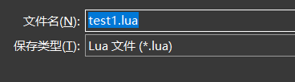

# 🔧导出地图

---

在经过了前几个专题之后，我们已经有足够的资格导出可用的地图。

## 导出流程

按下 `Ctrl + Shift + E` ，或者点击左上角 `文件 -> 导出为` ，你会来到这样的界面。 
在保存类型中，我们选择 `.lua` 格式，接下来，起一个名字，和其他 `.lua` 文件放在一起即可（你也可以新建文件夹好管理，这里不再演示）。 
 

到这里，我们的地图就已经成功导出到了 `Maps/` 文件夹中，如果你准备好使用它了，直接进行下一个专题。

---

## 更新地图

假设你这次的导出结果并不理想，导出之后才想起来有些东西忘了修改了，这没关系，而且十分正常。 

首先你需要做出你想要的修改内容，然后重复上述导出流程中的内容即可。